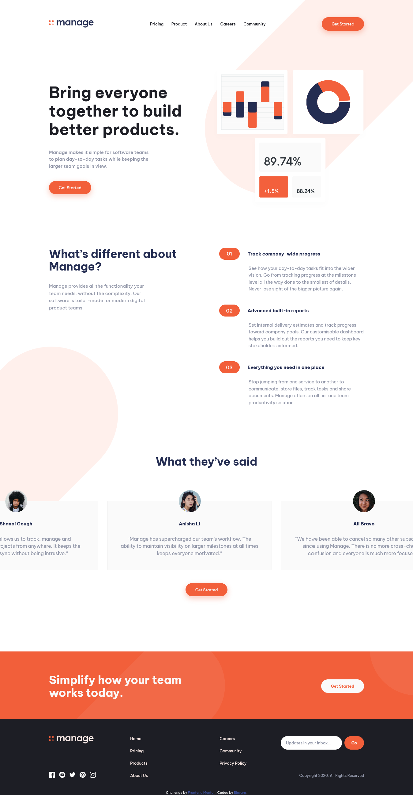
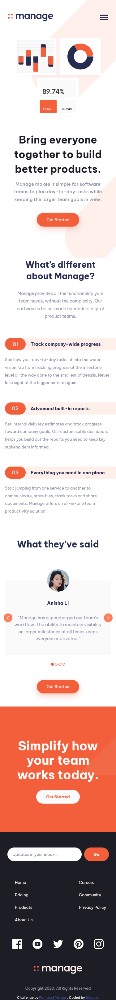

# Frontend Mentor - Manage landing page solution

This is a solution to the [Manage landing page challenge on Frontend Mentor](https://www.frontendmentor.io/challenges/manage-landing-page-SLXqC6P5). Frontend Mentor challenges help you improve your coding skills by building realistic projects.

## Table of contents

- [Overview](#overview)
  - [The challenge](#the-challenge)
  - [Screenshot](#screenshot)
  - [Links](#links)
- [My process](#my-process)
  - [Built with](#built-with)
  - [What I learned](#what-i-learned)
  - [Useful resources](#useful-resources)
- [Author](#author)

## Overview

### The challenge

Users should be able to:

- View the optimal layout for the site depending on their device's screen size
- See hover states for all interactive elements on the page
- See all testimonials in a horizontal slider
- Receive a success message when the sign up form is submitted
- Receive an error message when the newsletter sign up `form` is submitted if:
  - The `input` field is empty
  - The email address is not formatted correctly

### Screenshot




### Links

- Solution URL: [Solution URL](https://www.frontendmentor.io/solutions/responsive-landing-page-with-a-continuous-scroll-testimonial-section-HmvX8FGgjF)
- Live Site URL: [https://mange-landing-page-frontend-mentor.netlify.app/](https://mange-landing-page-frontend-mentor.netlify.app/)

## My process

### Built with

- Semantic HTML5 markup
- CSS custom properties
- Flexbox
- Javascript

### What I learned

I learned how to create a continuously scrolling animation for articles within a container, with customizable speed and direction, and additional accessibility adjustments for users who prefer reduced motion.

- a div with the class scroller that acts as the container for the articles. It includes custom attributes:
- data-direction: Defines the scrolling direction (either left or right).
- data-speed: Sets the scrolling speed (slow or fast).

```html
<div class="scroller" data-direction="right" data-speed="slow">
  <article>...</article>
  <article>...</article>
  <article>...</article>
  <article>...</article>
</div>
```

- When **data-animated="true"** is added to **.scroller**, **overflow: hidden;** hides any overflowing content, ensuring a clean scroll.

```css
.scroller[data-animated='true'] {
  overflow: hidden;
}

.scroller[data-animated='true'] .scroller__inner {
  width: max-content;
  flex-wrap: nowrap;
  animation: scroll var(--_animation-duration, 40s) var(
      --_animation-direction,
      forwards
    )
    linear infinite;
}

.scroller[data-direction='right'] {
  --_animation-direction: reverse;
}

.scroller[data-direction='left'] {
  --_animation-direction: forwards;
}

.scroller[data-speed='fast'] {
  --_animation-duration: 20s;
}

.scroller[data-speed='slow'] {
  --_animation-duration: 60s;
}

@keyframes scroll {
  to {
    transform: translate(calc(-50% - 0.5rem));
  }
}
```

- The JavaScript is responsible for initializing the scrolling animation and creating a continuous loop effect.
- Before animation begins, window.matchMedia('(prefers-reduced-motion: reduce)') checks if the user prefers reduced motion. If so, the animation is skipped.
- Set data-animated: Adds **data-animated="true"** to **.scroller** to activate CSS styles for scrolling.
  = Cloning Content: To achieve a seamless, continuous scroll effect, the original articles inside .scroller\_\_inner are duplicated. Each duplicated article is marked aria-hidden="true" for screen readers to avoid redundant reading, making it accessible.

```js
const scroller = document.querySelector('.scroller');
if (!window.matchMedia('(prefers-reduced-motion: reduce)').matches) {
  addAnimation();
}
function addAnimation() {
  scroller.setAttribute('data-animated', true);

  const scrollerInner = scroller.querySelector('.scroller__inner');

  const scrollerContent = Array.from(scrollerInner.children);

  scrollerContent.forEach((item) => {
    const duplicatedItem = item.cloneNode(true);
    duplicatedItem.setAttribute('aria-hidden', true);
    scrollerInner.appendChild(duplicatedItem);
  });
}
```

### Useful resources

- [Youtube: Kevin Powell](https://www.youtube.com/watch?v=iLmBy-HKIAw) - This video helped me create a continuously scrolling animation for articles within a container. I really liked this pattern and will use it going forward.
- [Font Awesome](https://fontawesome.com) - This is an amazing font icon library.

## Author

- Frontend Mentor - [@binzam](https://www.frontendmentor.io/profile/binzam)
- Twitter/X - [@\_bin_yam](https://x.com/_bin_yam)
